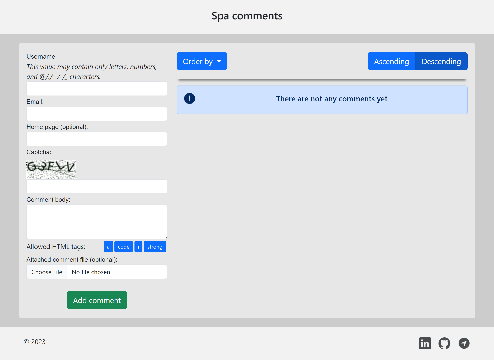

<a href="https://gubchik123.pythonanywhere.com/" target="_blank"></a>

_This is a page for leaving comments. Users can add comments with various features, and all the entered comments are saved in a relational database (DB), including user data for identification._

## Demo

Click **<a href="https://gubchik123.pythonanywhere.com/" target="_blank">here</a>** to open the project.

<p></p>

## Project modules

<a href='https://pypi.org/project/Django'></a> <a href='https://pypi.org/project/django-simple-captcha'></a> <a href='https://pypi.org/project/mysqlclient'></a> <a href='https://pypi.org/project/Pillow'></a> <a href='https://pypi.org/project/python-dotenv'></a> <a href='https://pypi.org/project/pytz'></a> 

## Features

- Users can leave comments with the following fields:
  1. User Name (alphanumeric characters) - required field.
  2. E-mail (email format) - required field.
  3. Home page (URL format) - optional field.
  4. CAPTCHA (alphanumeric characters) - image and required field.
  5. Text (the main message text) - required field. HTML tags except the allowed ones are not allowed.

- The main page of the application has the following requirements:

  1. Comments can have multiple replies (cascade display).
  2. Top-level comments (not replies) are displayed in a table format with the ability to sort by the following fields: User Name, E-mail, and Date added (both in ascending and descending order).
  3. Messages are paginated with 25 messages per page.

- JavaScript:
  1. Server-side and client-side validation of input data.
  2. Panel with buttons for HTML tags (`[i]`, `[strong]`, `[code]`, `[a]`).

- File Handling:

  1. Users can add an image or a text file to their comment.
  2. Images resizes proportionally to a maximum size of 320x240 pixels if the uploaded image is larger. Allowed file formats are JPG, GIF, and PNG.
  3. Text files should not exceed 100 KB in size, and the only allowed format is TXT.
  4. File preview includes visual effects (e.g. [Lightbox2](https://lokeshdhakar.com/projects/lightbox2/)).

- Regular Expressions:

  1. Users can use the following allowed HTML tags in their messages: `<a href="" title=""> </a> <code> </code> <i> </i> <strong> </strong>`.
  2. There is validation to ensure proper closing of tags.

## Technology Stack

The project utilizes the following technologies and tools:

-   Backend:
    -   Python programming language (OOP);
    -   Django framework with the django-simple-captcha extension;
    -   MySQL database (Django ORM).
-   Frontend:
    -   HTML & CSS;
    -   JavaScript;
    -   Bootstrap 5.
- Git for version control.

## Environment Variables

To run this project, you will need to add the following environment variables:

`SECRET_KEY`
`DB_HOST` `DB_NAME` `DB_USER` `DB_PASSWORD`

> Look at the file_env_example.txt

## Getting Started

To get started with the project, follow these steps:

1. Clone the repository:
    ```
    git clone https://github.com/Gubchik123/dZENcode-test-task.git
    ```

2. Go to the project directory:

    ```
    cd dZENcode-test-task
    ```

3. Install the required dependencies:
    ```
    pip install -r requirements.txt
    ```

4. Set up the database connection and configurations according to the selected database engine. Apply migrations
    ```
    python manage.py migrate
    ```

5. Run the Django development server:
    ```
    python manage.py runserver
    ```

    > **Note:** Don't forget about environment variables

6. Access the application in your web browser at `http://127.0.0.1:8000` (or the appropriate URL based on your Django configuration).

## Conclusion

The "Spa comments" is a feature-rich web application built using Django, JavaScript, and MySQL. It allows users to leave comments with various options, ensures data validation and security, and provides a user-friendly interface with interactive elements.
